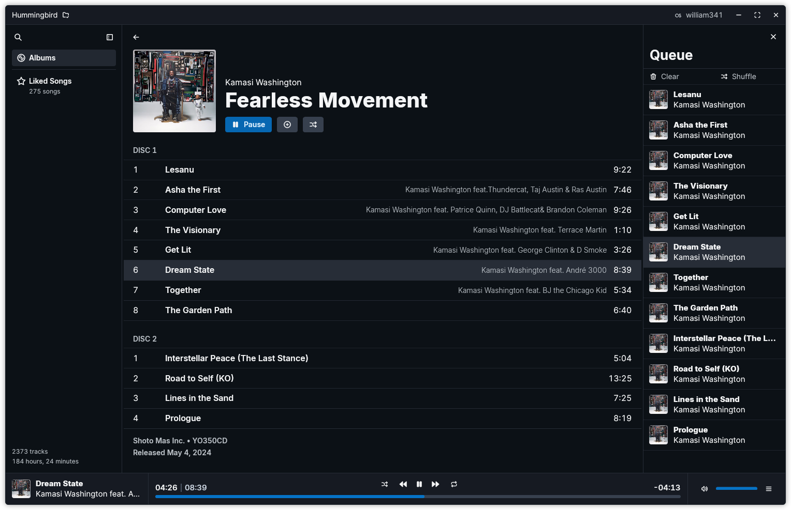

# Muzak



Muzak is a modern music player written in Rust using GPUI, designed to be
performant and lightweight while maximizing extensibility and maintaining a high
design standard.

# Features
- Fully native application with no web component
- FLAC, MP3, OGG and WAV playback
- Linux, macOS and Windows support
- SQLite-backed library
- Theming with hot reload
- Scrobbling (last.fm) support

## Planned Features
- WASM Extension support:
  - Codecs
  - Scrobble services
  - Metadata services
- Playlists
- Advanced search
- AAC and Opus support

# Usage
Muzak hasn't yet seen a full release, but it's already usable.

> [!WARNING]
> Windows support isn't tested frequently, as I don't use Windows reguarly.
> If you're on Windows and encounter a bug, please open an issue.

The latest commit is built using Github Actions and uploaded to the
[latest](https://github.com/143mailliw/muzak/releases/tag/latest) tag
automatically. The macOS binary is signed and notarized, and should work on
most macOS versions out of the box.

## Building
```sh
# install relevant devel packages for xcb-common, x11, wayland, openssl, and pulseaudio if on Linux
git clone https://github.com/143mailliw/muzak
cd muzak

# last.fm api keys must be set in the environment for scrobbling to work
# these can be obtained from https://www.last.fm/api/account/create
# you can also set these in a .env file in the root of the project
#
# Muzak will still build without these keys, but scrobbling will be disabled
export LASTFM_API_KEY="your key"
export LASTFM_API_SECRET="your secret"

# debug mode will result in noticable slowdown in some cases
cargo build --release
```

# Contributing
If you make a pull request, try not to introduce any warnings (other than unused
enums/fields, which is fine if you're working on an API that could be used by
future extention support), and ensure your code was formatted with `rustfmt`
before submitting.

Avoid breaking platforms if possible. Pull requests will be tested on Linux and
macOS - if your commit breaks these platforms, it will not be merged. Your
commit should not break the build on Windows, but due to time constraints it
may not be tested.
